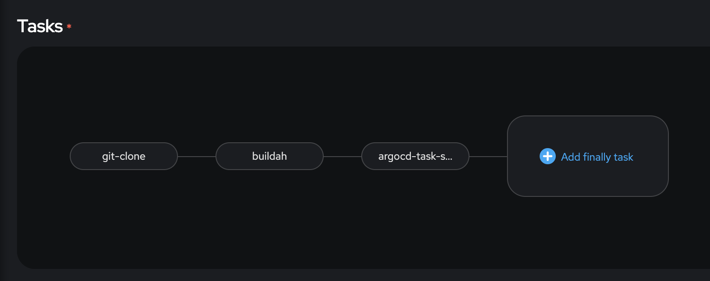

# Deploy on openshift
oc new-app --name guise-cmline  https://github.com/arslankhanali/GuiseAI-Openshift  
oc expose svc guise-cmlin  
oc delete all -l app=guise-cmline
# MLOps


## Tekton

1. Install pipeline operator
2. Create pipeline instance
3. Create workspace
   1. workspace = edge-workspace
4. git clone
   1.  display name = git-clone
   2.  url = https://github.com/arslankhanali/GuiseAI-Openshift
   3.  workspace = edge-workspace
5. buildah
   1. display name = buildah
   2. IMAGE = quay.io/arslankhanali/guise
   3. workspace = edge-workspace
6. Create a secret to access quay.io to push to it
   1. https://tekton.dev/docs/pipelines/auth/#configuring-basic-auth-authentication-for-docker
   2. ```yaml
      apiVersion: v1
      kind: Secret
      metadata:
      name: basic-user-pass
      annotations:
         tekton.dev/docker-0: https://quay.io # Described below
      type: kubernetes.io/basic-auth
      stringData:
      username: arslankhanali
      password: <pass>
      ```
7. Give service account 'pipeline' access to the secret
   1. edit yaml
   2. ```yaml
      secrets:
         - name: pipeline-dockercfg-fgppj
         - name: basic-user-pass
      ```
8. Start
   1. Choose VolumeClaimTemplate
## Argo cd
1. Build using manifest folder
2. Install gitops operator
3. Create argocd instance
4. edit yaml. In line 209
5. ```yaml
   rbac:
      - defaultPolicy: 'role:admin'
   ```
6. Login to argo cd using the route
7. Create a project
   1. App name = <>
   2. project = default
   3. repo url = https://github.com/arslankhanali/GuiseAI-Openshift
   4. path = manifest
   5. Sync policy = automatic
   6. destination url = https://kubernetes.default.svc
   7. namespace = <user2>
8. Test 
   1. Delete the app
      1. oc delete all -l app=guiseai 
   2. See in Argo cd UI that the components are redeployed immediatly
   3. Try with both self heal enabled and disabled.
      1. With disabled, since service is not deployed, the route deployment will break
      2. With enabled, route will be exposed automatically once the service is up


## ArgoCD - remote cluster
#### Download CLI
``` sh
curl -sSL -o argocd-linux-amd64 https://github.com/argoproj/argo-cd/releases/latest/download/argocd-linux-amd64
sudo install -m 555 argocd-linux-amd64 /usr/local/bin/argocd
rm argocd-linux-amd64
```
> https://argo-cd.readthedocs.io/en/stable/getting_started/
> 
1. Login to cluster with Argocd installed and get the password for argo cd
2. ```sh
   export ARGOCD_PASSWORD=$(oc get secret <argocd-cluster> -n <user2> -o jsonpath='{.data.admin\.password}' | base64 -d)
   echo $ARGOCD_PASSWORD

   # Another way to get password is by UI. Go to Developer->Secrets. Look for:
      # Name= argocd-cluster (name might be different for you) 
      # Type= Opaque 
      # Size= 1 
   # Reveal values -> copy admin.password

   #Test password by logging in like:-
      #argocd login argocd-server-user2.apps.anomaly-cluster.rqdu.p1.openshiftapps.com
      #username: admin
      #password: $ARGOCD_PASSWORD
   ```
3. Login 'as admin' to remote cluster where you want to deploy argocd service account
> When getting certificate error for RHPDS use '--insecure-skip-tls-verify=true' flag while logging in
4. ```sh
   argocd login <argocd-server-user2.apps.anomaly-cluster.rqdu.p1.openshiftapps.com>
   username: admin
   password: $ARGOCD_PASSWORD

   kubectl config get-contexts -o name
   argocd cluster add <context-name-from-previous-cmd>
   ```
5. Confirm in argo cd UI settings/clusters that a new cluster has been added

## ArgoCD (argocd-task-sync-and-wait) sync in Tekton
1. Choose "argocd-task-sync-and-wait" task in pipeline
   1. application-name = guiseai
   2. revision = HEAD
   3. flags = --insecure
2. Apply 'usage' from https://hub.tekton.dev/tekton/Task/argocd-task-connect-repo/0.1
   1. I manually added Secret named 'argocd-env-secret'. Give it your argo username and password for admin account.
   2. Make sure 'argocd-env-configmap' Configmap is created
   3. It will also create a test 'argocd-pipeline-test' Pipeline. You don't have to use it. Use it to test 


